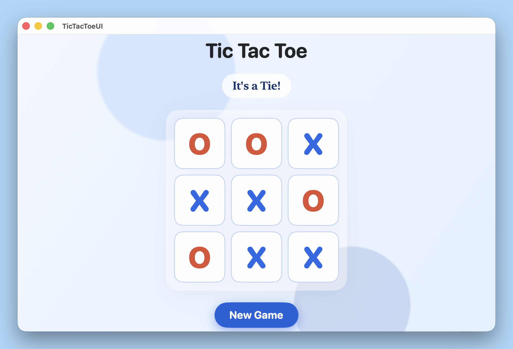

# TicTacToeCPP



Tic-Tac-Toe with:

- C++ game engine (static library)
- SwiftUI macOS app UI

## Requirements

- macOS
- Xcode (with command line tools)
- CMake 3.10+

## Project Structure

- `cpp-engine/`: C++ engine and C API
- `TicTacToeUI/`: SwiftUI macOS app
- `TicTacToeUI/TicTacToeUI/libs/`: static lib + C header used by Swift

## Quick Start (Recommended)

Run the helper script from project root:

```sh
sh ./build_and_run.sh
```

This will:

1. Configure and build the C++ static library.
2. Copy `libtictactoe.a` to `TicTacToeUI/TicTacToeUI/libs/`.
3. Copy `tictactoe_c_api.h` to `TicTacToeUI/TicTacToeUI/libs/`.
4. Build the Xcode project.

Optional: launch the app after building (will open the app window):

```sh
sh ./build_and_run.sh --run
```

If the app does not appear, check for errors in the terminal or try launching the built app manually from the path printed by the script.

## Manual Setup Steps

From project root:

1. Build C++ engine

   ```sh
   cmake -S cpp-engine -B cpp-engine/target/release -DCMAKE_BUILD_TYPE=Release
   cmake --build cpp-engine/target/release --config Release
   ```

2. IMPORTANT: Copy static library into app libs folder

   ```sh
   cp cpp-engine/target/release/libtictactoe.a TicTacToeUI/TicTacToeUI/libs/
   ```

3. Copy API header used by Swift module

   ```sh
   cp cpp-engine/src/tictactoe_c_api.h TicTacToeUI/TicTacToeUI/libs/
   ```

4. Build the macOS app

   ```sh
   xcodebuild -project TicTacToeUI/TicTacToeUI.xcodeproj -scheme TicTacToeUI -configuration Debug -destination 'platform=macOS' build
   ```


## Notes

- The CMake setup builds a universal static library for both arm64 and x86_64 on macOS.
- If the app fails to link after C++ changes, rebuild engine and re-copy `libtictactoe.a` into `TicTacToeUI/TicTacToeUI/libs/`.
